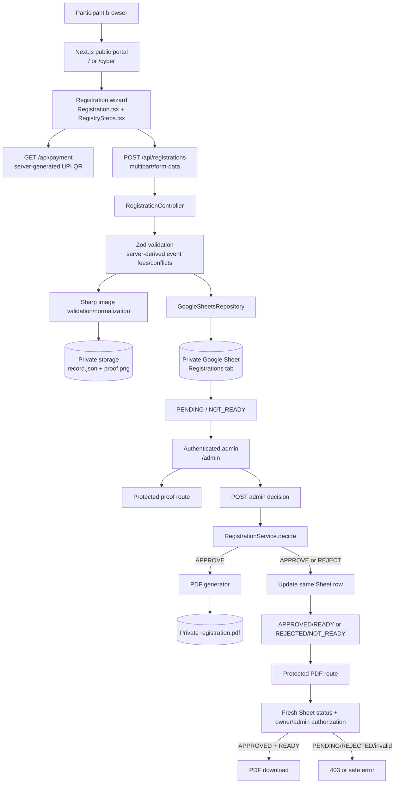
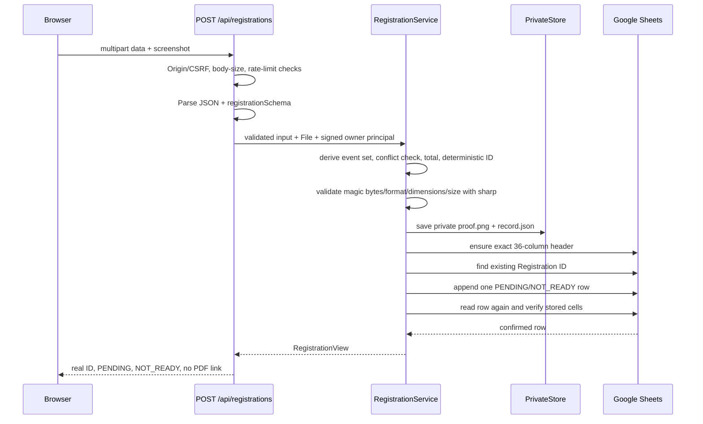
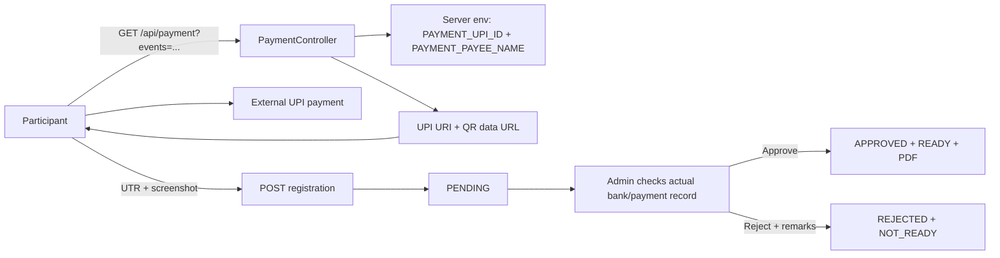
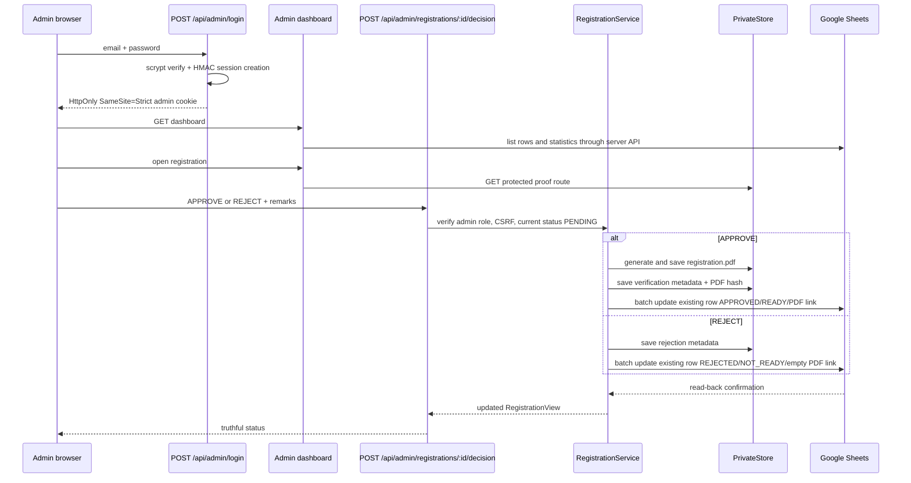
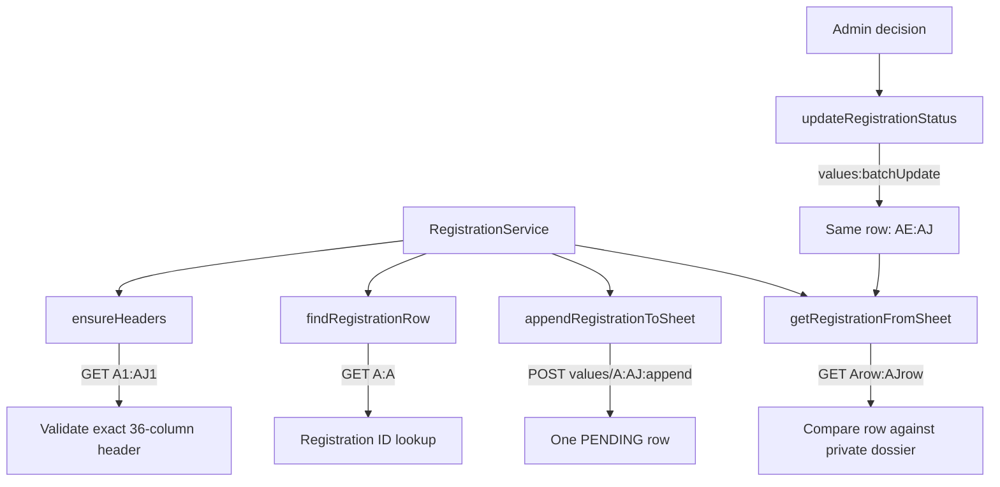
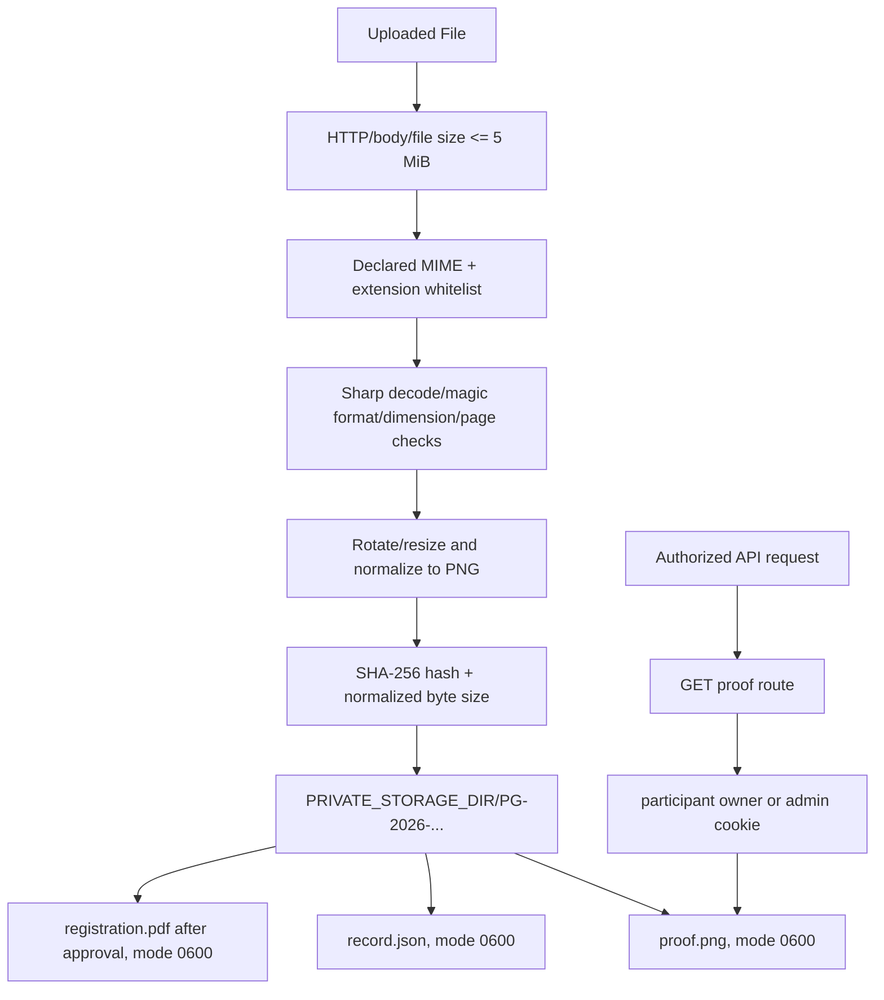
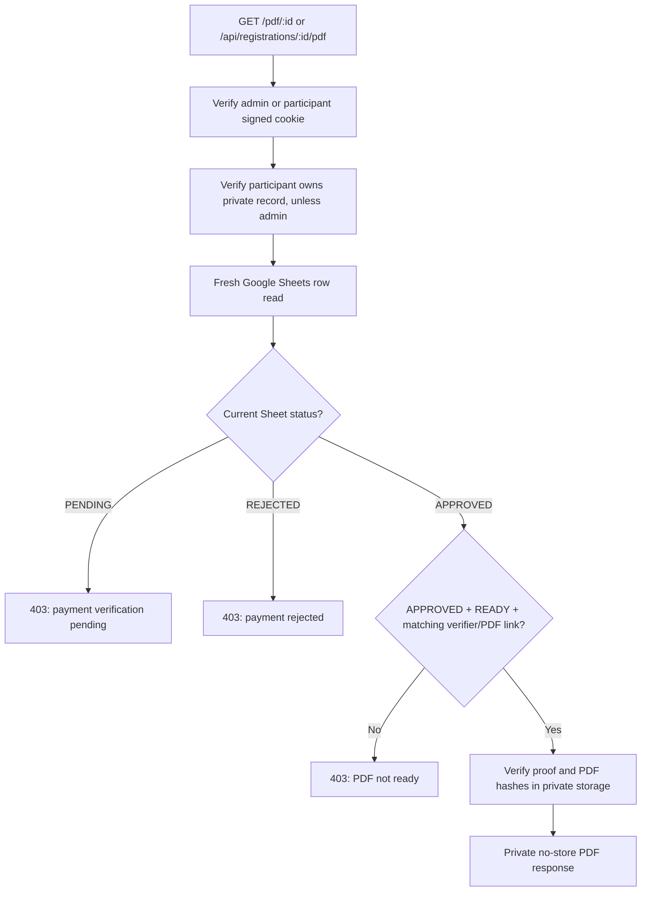
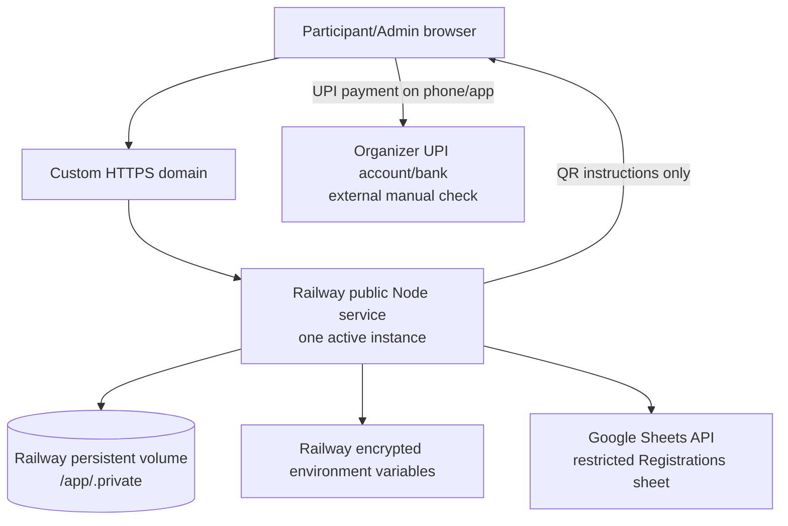

# Phase 3 Game — Production Architecture and Deployment Runbook

**Audit date:** 2026-10-06
**Application:** technIEEEks’26 Phase 3 Game registration portal
**Audit scope:** current repository contents, current tests/build, runtime configuration, Google Sheets integration, payment-proof workflow, admin approval, private storage, and deployment options.

## 1. Executive summary

This is a Next.js App Router application with two preserved public experiences:

- `/` — editorial registration portal.
- `/cyber` — cyber registration portal.

Both experiences use the same event catalog and the same server-backed registration workflow. The application does **manual** payment verification. It does not connect to a payment processor or automatically verify a bank transaction.

The current workflow is:

1. The participant chooses non-overlapping events and enters participant/team data.
2. The server generates the official UPI payment instructions from server-side environment variables.
3. The participant pays externally, enters a 12-digit UTR/reference, and uploads a PNG/JPEG/WEBP screenshot.
4. The server validates the request and image, stores a private payment dossier, and appends one `PENDING` row to Google Sheets.
5. An authenticated administrator opens the dashboard, views the private screenshot and registration details, then approves or rejects the payment manually.
6. Approval generates a PDF, changes the existing Sheet row to `APPROVED`/`READY`, and stores the protected PDF link. Rejection changes the same row to `REJECTED`/`NOT_READY` and leaves PDF access disabled.

The current implementation is suitable for a **single Node.js service with persistent local storage**. It is not suitable for an ephemeral/serverless-only filesystem without first moving screenshots, private records, and generated PDFs to durable object storage or a database-backed storage service.

### Current deployment conclusion

**Recommended first production platform: Railway, one service, one persistent volume, one active instance.** Railway supports a normal Next.js Node server, environment variables, HTTPS/custom domains, and persistent volumes. Mount the volume at `/app/.private` and set `PRIVATE_STORAGE_DIR=/app/.private`.

This recommendation preserves the current architecture. It does not make the application horizontally scalable: the in-process rate limiter, filesystem lock, Google Sheets source of truth, and single local volume all imply a single active application instance.

### Current verified state

Verified from the repository and local checks:

- Next.js `16.3.8`, React/React DOM `19.3.0`, TypeScript `^5.9.3`.
- Next.js requires Node.js `>=20.9.0`; the audit machine used Node `v24.21.0` and npm `11.19.0`.
- `npm run typecheck` passes.
- `npm test` passes all 14 backend/security tests and the event-date tests.
- `npm run build` passes and produces dynamic API/admin/PDF routes plus static public pages.
- `npm audit --omit=dev` reports 0 vulnerabilities at audit time.
- Local browser checks pass for both portals, the admin login, screenshot gating, truthful Google configuration failure, logos, and 320px mobile overflow.
- Live Google Sheets, live UPI payment, production DNS, production HTTPS, and production persistent-volume behavior are **not** verified in this workspace because production credentials/infrastructure are not configured.

## 2. Current repository and runtime map

```text
app/
├── page.tsx                         editorial public page (/)
├── cyber/page.tsx                   cyber public page (/cyber)
├── layout.tsx                       root metadata and local fonts
├── globals.css                      global CSS, focus styles, print rules
├── admin/
│   ├── layout.tsx                   admin shell and no-index metadata
│   ├── page.tsx                     server-side admin session gate
│   └── login/page.tsx               admin login page
├── api/
│   ├── payment/route.ts             server-generated UPI instructions/QR
│   ├── session/route.ts             participant owner-cookie bootstrap
│   ├── registrations/route.ts       POST registration, GET owned registrations
│   ├── registrations/[id]/route.ts  participant/admin status
│   ├── registrations/[id]/proof/route.ts private proof
│   ├── registrations/[id]/pdf/route.ts protected PDF
│   └── admin/
│       ├── login/route.ts
│       ├── logout/route.ts
│       └── registrations/
│           ├── route.ts
│           ├── [id]/route.ts
│           └── [id]/decision/route.ts
└── pdf/[id]/route.ts                protected canonical PDF URL

components/
├── Portal.tsx, Header.tsx, Hero.tsx, Footer.tsx
├── EventsList.tsx, EventsCatalog.tsx, Schedule.tsx, CyberSchedule.tsx
├── Protocols.tsx, MobileNav.tsx, Icon.tsx, SelectEventButton.tsx
├── Portal.module.css
├── registration/
│   ├── Registration.tsx
│   ├── RegistrySteps.tsx
│   ├── ParticipantFields.tsx
│   ├── EventSelection.tsx
│   ├── useEventSelection.ts
│   └── Registration.module.css
└── admin/
    ├── AdminLogin.tsx
    ├── AdminDashboard.tsx
    └── Admin.module.css

lib/
├── events.ts
├── registration.ts
├── registration-data.ts
└── server/
    ├── application.ts
    ├── auth.ts
    ├── config.ts
    ├── controllers.ts
    ├── errors.ts
    ├── googleSheets.ts
    ├── images.ts
    ├── pdf.ts
    ├── privateStore.ts
    ├── rateLimit.ts
    ├── registrationService.ts
    └── assets/dejavu-sans.ttf

scripts/
├── check-google.ts
└── hash-admin-password.mjs

tests/
├── backend.test.ts
└── events.test.ts

public/assets/
├── ieee-gehu-logo.png
├── gehu-logo.png
└── existing event/branding/font assets
```

### Commands and build behavior

| Command | Actual script | Purpose |
|---|---|---|
| Development | `npm run dev` | Next.js development server |
| Production build | `npm run build` | Turbopack optimized production build |
| Production start | `npm run start` | `next start` |
| Typecheck | `npm run typecheck` | `tsc --noEmit` |
| Tests | `npm test` | Node test runner with `tsx`, all `tests/*.test.ts` |
| Google check | `npm run check:google` | Validates configured Sheet headers/read access |
| Admin password | `npm run admin:password -- '<password>'` | Generates an `scrypt:<salt>:<hash>` value; never commit the output |

`next.config.ts` marks server-heavy packages as external, includes the PDF font in the admin decision route trace, and sets security headers. The production CSP omits `unsafe-eval`; development adds `unsafe-eval` and `ws:` for Next.js tooling only.

## 3. High-level architecture



## 4. Request and data flows

### 4.1 Registration flow



The participant-provided `amount`, event IDs, roster shape, UTR, and statuses are not trusted as approval authority. The server validates event IDs and derives the authoritative total from `lib/events.ts`. The server never accepts client-provided `paymentStatus` or `pdfStatus` fields in the registration schema.

### 4.2 Payment instructions and manual verification



**Automatic verification:** none. There is no Razorpay/Stripe/bank API/webhook. The UPI QR is an instruction generator only. The UTR is evidence supplied by the participant and is not independently verified by the application.

### 4.3 Admin approval/rejection



The decision endpoint derives the transition from its validated `decision` enum. It does not accept a client payment status.

### 4.4 Authentication and session flow

```mermaid
sequenceDiagram
    participant B as Browser
    participant API as Admin API
    participant AUTH as AuthService
    participant C as HttpOnly cookie

    B->>API: POST /api/admin/login
    API->>AUTH: Origin check + rate limit + Zod body
    AUTH->>AUTH: scrypt(password, salt) + timingSafeEqual
    AUTH->>AUTH: HMAC-SHA256 signed session payload
    AUTH-->>API: pg_admin_session cookie
    API-->>B: HttpOnly; SameSite=Strict; 8-hour Max-Age; Secure on HTTPS
    B->>API: admin request with cookie
    API->>AUTH: verify signature, role, subject, expiry
    AUTH-->>API: admin principal or 401
```

Participants receive a signed `pg_participant` HttpOnly cookie. It is an ownership capability, not an account login. It binds the browser to its private registration record. Admins can read all registrations after admin authentication.

### 4.5 Google Sheets data flow



The service account uses `google-auth-library` and a JWT with the Sheets scope:

```text
https://www.googleapis.com/auth/spreadsheets
```

The browser never calls Google APIs and never receives Google credentials.

### 4.6 File storage flow



The storage root is checked to ensure it is not `public/` or a child of `public/`. Registration IDs are restricted to `PG-2026-[A-F0-9]{16}`, preventing path traversal through the ID. Files are served only through authenticated route handlers.

### 4.7 PDF authorization flow



The client cannot authorize a PDF with query parameters, hidden fields, localStorage, sessionStorage, or a forged response. The server reads the current Sheet row on every PDF request.

## 5. Component map

| Component | File/directory | Responsibility | Talks to | Production dependency |
|---|---|---|---|---|
| Public composition | `components/Portal.tsx` | Preserves editorial/cyber page composition | Header, Hero, events, schedules, registration | Next.js page rendering |
| Header/branding | `components/Header.tsx`, `components/Portal.module.css` | Navigation, exact IEEE GEHU and GEHU logos | Public anchors, `next/image` | PNG assets in `public/assets` |
| Hero/rules/events | `components/Hero.tsx`, `Protocols.tsx`, `EventsList.tsx`, `EventsCatalog.tsx`, `Schedule.tsx`, `CyberSchedule.tsx` | Public event presentation and event selection entry points | `lib/events.ts`, selection custom event | Static event data |
| Registration wizard | `components/registration/Registration.tsx` | State machine for both existing forms; submit/loading/error/status | Registry steps, selection hook, `/api/registrations` | Browser `fetch`, multipart upload |
| Participant fields | `components/registration/ParticipantFields.tsx` | Participant and academic data entry | Registration wizard | Browser form validation |
| Team/Review/Payment/Confirmation | `components/registration/RegistrySteps.tsx` | Roster, consent, server UPI QR, screenshot input, truthful status/PDF link | `/api/payment`, `/api/registrations`, protected PDF URL | UPI configuration, server API |
| Event validation | `components/registration/EventSelection.tsx`, `useEventSelection.ts` | UI conflict prevention and totals | `lib/events.ts` | Server repeats all authoritative checks |
| Admin login | `components/admin/AdminLogin.tsx` | Admin credential form and loading/error states | `POST /api/admin/login` | Admin env configuration, HTTPS |
| Admin dashboard | `components/admin/AdminDashboard.tsx` | Statistics, filters, private screenshot, approve/reject controls | Admin APIs, proof API, PDF link | Google Sheets, private storage |
| Registration API | `app/api/registrations/route.ts` | POST multipart registration and GET owned records | `RegistrationController` | Node runtime, Google, persistent disk |
| Payment API | `app/api/payment/route.ts` | Validates event IDs and generates UPI URI/QR | `RegistrationController`, `qrcode`, `lib/events` | `PAYMENT_UPI_ID`, `PAYMENT_PAYEE_NAME` |
| Proof API | `app/api/registrations/[id]/proof/route.ts` | Authenticated private screenshot response | Controller, `PrivateStore` | Persistent disk, signed cookies |
| Status API | `app/api/registrations/[id]/route.ts` | Owner/admin status response | Controller, Google/private store | Google Sheets and ownership cookie |
| PDF APIs | `app/pdf/[id]/route.ts`, `app/api/registrations/[id]/pdf/route.ts` | Protected PDF response | `RegistrationService.pdf` | Google status, private disk |
| Admin decision API | `app/api/admin/registrations/[id]/decision/route.ts` | Approve/reject route | Controller, service | Admin session, Google, PDF font, disk |
| Admin list/details APIs | `app/api/admin/registrations/route.ts`, `[id]/route.ts` | Admin data and statistics | Controller, Google/private store | Admin session |
| Auth/session | `lib/server/auth.ts` | scrypt password verification, HMAC sessions, cookies, CSRF origin | Controllers, admin page | `SESSION_SECRET`, `ADMIN_*`, HTTPS |
| Config | `lib/server/config.ts` | Parses env, validates origin/storage/payment prerequisites | Application/auth/services | Production environment variables |
| Registration service | `lib/server/registrationService.ts` | Business rules, ID/hash, idempotency, status transitions | Sheets, private store, image/PDF functions | Google + persistent disk |
| Google service | `lib/server/googleSheets.ts` | JWT-authenticated Sheet reads/appends/batch updates | Google Sheets REST API | Google Cloud service account and shared Sheet |
| Private storage | `lib/server/privateStore.ts` | Atomic local file writes, integrity hashes, process lock | Node filesystem, `proper-lockfile` | Persistent writable disk; one active instance |
| Image validation | `lib/server/images.ts` | MIME/extension/decoded image/dimension/size validation and normalization | `sharp` | Node runtime/native sharp support |
| PDF generation | `lib/server/pdf.ts` | Generates approved registration PDF and attached JSON dossier | `pdf-lib`, `fontkit`, bundled font | Node runtime, traced font asset |
| Error handling | `lib/server/errors.ts` | Safe JSON errors, request IDs, limited server logging | Controllers | Production log collection |
| Rate limiting | `lib/server/rateLimit.ts` | In-memory per-process limits and bucket cap | Controllers | One instance; external limiter needed for scale |
| Security headers | `next.config.ts` | CSP, HSTS production, frame/referrer/content headers | All routes | HTTPS and correct deployment origin |
| Tests | `tests/backend.test.ts`, `tests/events.test.ts` | Backend workflow/security and date regression tests | Real services with isolated Google transport | Node, tsx, sharp, pdf-lib |

## 6. Google Sheets setup and schema

### Required Google configuration

The application expects:

```text
GOOGLE_SHEET_ID=<spreadsheet id from the Sheet URL>
GOOGLE_SERVICE_ACCOUNT_EMAIL=<service-account email>
GOOGLE_PRIVATE_KEY=<private key with escaped or literal newlines>
GOOGLE_SHEET_NAME=Registrations
```

The code uses a service-account JWT, not browser OAuth. Before production:

1. Create or select a Google Cloud project.
2. Enable the Google Sheets API for that project.
3. Create a service account in IAM.
4. Create a credential/key using your organization’s approved secret-management policy. Do not commit the JSON key.
5. Create the `Registrations` tab in the target Sheet.
6. Share the Sheet directly with the service-account email as **Editor**. Keep general access **Restricted**; do not publish the Sheet or use “Anyone with the link.”
7. Put only the non-secret Sheet ID, service-account email, tab name, and secret private key in the hosting provider’s encrypted environment variables.
8. Run `npm run check:google` from an environment containing the production variables. Expected output is a row count and the `Registrations` tab name.

Google’s official IAM documentation: <https://cloud.google.com/iam/docs/service-accounts-create>. The application’s required authorization scope is visible in `lib/server/googleSheets.ts`.

### Exact column order

The first row must contain exactly these 36 columns, in order:

```text
Registration ID
Registration Date
Event Name
Event Date
Event Time
Team / Participant Name
Registration Type
Team Size
Captain Name
Captain Email
Captain Phone
College / University
City
Participant 1 Name
Participant 1 Email
Participant 1 Phone
Participant 2 Name
Participant 2 Email
Participant 2 Phone
Participant 3 Name
Participant 3 Email
Participant 3 Phone
Participant 4 Name
Participant 4 Email
Participant 4 Phone
Participant 5 Name
Participant 5 Email
Participant 5 Phone
Payment Amount
Payment Screenshot
Payment Status
Admin Remarks
Verified By
Verification Date
PDF Status
PDF Link
```

### Reads, writes, and integrity behavior

`GoogleSheetsRepository` implements:

- `ensureHeaders()` — creates the exact header row if the tab is empty, otherwise rejects mismatched headers.
- `listRegistrations()` — reads `A1:AJ10001`, validates headers, normalizes row width, and rejects duplicate IDs.
- `findRegistrationRow(id)` — reads column A and rejects duplicate matches.
- `getRegistrationFromSheet(id)` — finds and reads one complete row.
- `appendRegistrationToSheet(cells)` — checks the ID, then appends one row with `valueInputOption=RAW` and `INSERT_ROWS`.
- `updateRegistrationStatus(...)` — uses one `values:batchUpdate` call to update status, verifier metadata, PDF status, and PDF link in the existing row.

The registration service reads the Sheet row back after append and after a decision. It compares the original registration fields with the private record and checks the expected state. On ambiguous Google failures, `appendAttempted` prevents a blind second append; the next retry first checks whether the row exists.

### Google failure behavior

- Missing Google configuration returns a controlled `503`; the browser must not see success.
- Upstream failures return a controlled `503` without credentials or stack traces.
- Status/PDF access fails closed if the current Sheet cannot be read.
- The filesystem and Sheet are not one ACID transaction. A backup/reconciliation procedure is required for ambiguous outages.

## 7. Payment architecture

### What exists

- `GET /api/payment?events=...` derives the total from server event data.
- It validates that event IDs are known and non-overlapping.
- It reads `PAYMENT_UPI_ID` and `PAYMENT_PAYEE_NAME` only on the server.
- It returns a UPI URI and QR data URL generated by `qrcode`.
- The participant pays outside the application.
- The participant enters a 12-digit UTR/reference and uploads a screenshot.
- The server normalizes the screenshot and stores it privately.
- Registration starts `PENDING`/`NOT_READY`.
- An admin manually compares the proof, UTR, amount, recipient, and real bank/payment record.

### What does not exist

- No payment gateway SDK.
- No automatic transaction lookup.
- No payment webhook.
- No automatic approval.
- No claim that entering a UTR proves payment.

That matches the required manual business flow. The application’s UPI details are instructions, not authoritative payment verification.

## 8. Private storage architecture and deployment implications

### Files written

For each registration ID under `PRIVATE_STORAGE_DIR/PG-2026-<id>/`:

| File | Created | Purpose |
|---|---|---|
| `proof.png` | submission | Normalized payment screenshot, mode `0600` |
| `record.json` | submission | Private participant/team input, owner hash, input hash, proof hash/size, append state, verification metadata |
| `registration.pdf` | approval | Generated approved PDF, mode `0600`, hash stored in `record.json` |
| lock directory | write operations | `proper-lockfile` process-level write serialization |

The root is resolved from `PRIVATE_STORAGE_DIR` and rejected if it is `public/` or beneath `public/`. No screenshot/PDF is placed in the public assets directory. The admin browser receives a short-lived in-memory object URL created from the authenticated proof response; the browser does not receive a filesystem path.

### Validation

- Request body cap: 5 MiB plus multipart overhead.
- File cap: 5 MiB.
- Allowed declared MIME types: `image/png`, `image/jpeg`, `image/webp`.
- Allowed extensions: `.png`, `.jpg/.jpeg`, `.webp`.
- `sharp` must successfully decode the content; declared MIME and actual format must agree.
- Empty, animated/multi-page, missing-dimension, oversized decoded, and invalid images are rejected.
- The normalized output is PNG with a SHA-256 hash and recorded byte size.

### Live-host requirement

The default `PRIVATE_STORAGE_DIR=./.private` is only safe when the working directory is on durable storage. An ephemeral container filesystem can lose all pending proofs, approved PDFs, and ownership records on restart/redeploy. This is a deployment blocker until a persistent volume is attached and tested.

The current code also uses a process/filesystem lock and an in-memory rate limiter. Run one application instance. Do not enable horizontal replicas until storage, locking, and rate limiting are moved to shared infrastructure.

## 9. Admin authentication and authorization

### Credential flow

- `ADMIN_EMAIL` is normalized to lowercase.
- `ADMIN_PASSWORD_HASH` must match `scrypt:<32 hex salt>:<128 hex digest>`.
- `scripts/hash-admin-password.mjs` generates the value using a random 16-byte salt and `scrypt(..., 64)`.
- Login uses `timingSafeEqual` and never stores the plaintext password.

### Cookies

| Cookie | Subject | Lifetime | Flags |
|---|---|---:|---|
| `pg_admin_session` | Admin email/role/expiry/nonce, HMAC-signed | 8 hours | HttpOnly, Path `/`, SameSite Strict, Secure when `APP_URL` is HTTPS |
| `pg_participant` | Browser owner ID/role/expiry/nonce, HMAC-signed | 30 days | HttpOnly, Path `/`, SameSite Strict, Secure when `APP_URL` is HTTPS |

The HMAC key is `SESSION_SECRET`, which must be at least 32 characters/bytes in configuration. Every protected request verifies the signature, role, expiry, and admin subject. The admin page performs a server-side session check and redirects unauthenticated browsers to `/admin/login`.

### CSRF and proxy behavior

State-changing endpoints require the request `Origin` to equal the configured `APP_URL`; cross-site fetches are rejected. Cookies use SameSite Strict. `TRUST_PROXY=true` should only be set when the hosting proxy overwrites `X-Forwarded-For`; otherwise leave it `false`.

### Production requirements

- Use a unique random `SESSION_SECRET` in production.
- Use a unique long admin password and do not reuse it elsewhere.
- Set `APP_URL` to the exact HTTPS origin with no trailing path, query, or slash.
- Confirm the host preserves `Set-Cookie` headers.
- Test expiration by waiting for or temporarily using a short-lived staging credential; do not extend production cookie life to make testing easier.

## 10. Security audit

### Safe/implemented

- Server-only modules are marked with `server-only`.
- Secrets are read from environment variables, not source code.
- `.env.example` contains placeholders only.
- `.gitignore` now ignores `.env*` while allowing `.env.example`; no local secret file should be committed.
- Server-side Zod validation covers participant data, roster, event IDs, conflicts, amount, UTR, agreements, admin login, and decisions.
- Server derives event fees and conflict checks from `lib/events.ts`.
- Payment screenshot is mandatory at the controller and service layers.
- Image type, extension, actual decoded format, dimensions, pages, size, and hash are validated.
- Private paths are outside `public/`, and IDs are allow-listed.
- Google credentials never reach the browser.
- Status transitions are server-owned.
- Owner/admin authorization is checked before proof/PDF access.
- PDF status is re-read from Google Sheets on every PDF request.
- PDF/proof responses use private/no-store and nosniff headers.
- CSRF Origin checking and SameSite Strict cookies are implemented.
- Security headers include CSP, X-Frame-Options, nosniff, Referrer-Policy, Permissions-Policy, COOP, CORP, DNS prefetch off, and production HSTS.
- Production CSP omits `unsafe-eval`; development adds it only for dev tooling.
- No user-controlled URL is fetched server-side, so no application SSRF path was found.
- No SQL/database query layer exists, so SQL injection is not present in the current implementation.
- Rate-limit buckets have a memory cap and eviction behavior.
- Tests cover missing/forged files, ownership, CSRF, admin auth, duplicate retries, Google failure, approval/rejection, and PDF state.

### Warnings

1. **In-process rate limiter:** limits are per Node process and reset on restart. This is acceptable for the recommended one-instance launch but not for horizontal scale or coordinated abuse protection.
2. **Local filesystem as durable data:** backups are host/platform responsibility. A persistent volume is necessary but not a complete backup strategy.
3. **Google Sheets as operational database:** Sheet APIs have latency, quotas, human-edit risk, and limited transactional semantics. This is appropriate for the expected event volume only with careful Sheet permissions and backups.
4. **Logging:** 5xx errors log structured scope/request ID/type/upstream status through `console.error`; production must collect and restrict logs. The current code does not include Sentry or a centralized alerting integration.
5. **No dedicated health endpoint:** deployment health checks must use a public page or a future lightweight health route. A health endpoint is a useful future production-readiness enhancement but is not required to document the existing system.
6. **Admin login is a single shared credential:** there are no per-admin accounts, MFA, audit-user directory, or password reset flow. Protect the admin URL and rotate the credential when staffing changes.
7. **Single-instance architecture:** do not add replicas or a load balancer without moving storage and rate limits to shared services.
8. **HSTS preload:** the production header includes `preload`. Only submit the domain for preload after every subdomain that should be covered is permanently HTTPS-capable.

### Blockers before a real launch

- Production values for all required environment variables are not present in this workspace.
- A real Google Cloud service account, Sheets API enablement, Sheet ID, exact tab/header row, and restricted Sheet sharing are not configured or live-tested here.
- A real `PAYMENT_UPI_ID` and `PAYMENT_PAYEE_NAME` are not configured or payment-tested here.
- A persistent private volume and backup procedure are not configured here.
- The current worktree is dirty and includes uncommitted/untracked changes (`AGENTS.md`, `CLAUDE.md`, and source changes). Review and commit the intended release before deploying from GitHub.
- Live HTTPS/DNS/domain behavior is not verified here.

## 11. Development versus production

| Area | Development | Production |
|---|---|---|
| `APP_URL` | `http://localhost:3000` is allowed | Must be exact HTTPS public origin |
| Cookies | Secure flag omitted on HTTP localhost | Secure flag enabled automatically on HTTPS |
| CSP | `unsafe-eval` and `ws:` allowed for Next dev tooling | No `unsafe-eval`; no dev WebSocket allowance |
| HSTS | Not added | `Strict-Transport-Security` added |
| Storage | `./.private` can be local disposable test storage | Must map to persistent private volume |
| Google | Isolated test transport in tests; no real credentials required | Real service account and restricted Sheet required |
| UPI | Test/local values may be used only for browser checks | Real organizer recipient required; verify with a small real test payment |
| Logging | Console output is acceptable for local debugging | Collect structured 5xx logs without secrets; alert on repeated failures |
| Build | `next dev` | `npm run build` then `npm run start` |
| Source maps | Next defaults; no explicit production browser source-map setting | No explicit `productionBrowserSourceMaps` setting is enabled; review deployment output before release |
| HTTPS | Not available on localhost | Required for Secure cookies and HSTS |
| Scaling | One local process | One instance until shared state is introduced |

## 12. Hosting platform analysis

| Platform | Next.js/server APIs | Persistent local storage | PDF/image support | Env/custom domain/HTTPS | Fit for current architecture |
|---|---|---|---|---|---|
| **Railway** | Full Node.js service with `next build`/`next start`; Next.js docs list Railway as a deployment option | Persistent Volumes can be mounted to a service; Railway documents `/app` as the application root and requires `/app/.private` for relative `./.private` persistence | Suitable for Node `sharp`, `pdf-lib`, and local font asset | Environment variables, Railway domain, custom domains, and automatic SSL | **Recommended. Use one service, one volume, one instance.** |
| **Render** | Full Next.js web service with Node build/start commands | Paid Persistent Disk supports local files, but only one service instance can access it and disk prevents zero-downtime deploys | Suitable on Node web service | Dashboard env vars, custom domains, automatic TLS/HTTP redirect | Good alternative; accept brief deploy downtime and single-instance disk constraints |
| **Vercel** | Excellent Next.js/Node Function support and automatic build detection | Current local filesystem approach is not durable across serverless executions; would need object storage/database redesign | Node functions can run the libraries, but 4.5 MiB function payload limit conflicts with current 5 MiB screenshot policy plus multipart overhead | Excellent env/custom domain/HTTPS | **Not recommended without storage/upload architecture changes.** |
| **VPS/traditional Node** | Full `next start` support | Fully controllable persistent disk | Fully suitable | You manage env secrets, Nginx/Caddy, DNS, TLS, firewall, systemd, backups, updates | Viable and flexible; highest operational burden for a beginner |

Official references used for this decision:

- Next.js deployment: <https://nextjs.org/docs/app/getting-started/deploying>
- Railway volumes: <https://docs.railway.com/guides/volumes>
- Railway public networking/SSL: <https://docs.railway.com/guides/public-networking>
- Render persistent disks: <https://render.com/docs/disks>
- Render Next.js web service: <https://render.com/docs/deploy-nextjs-app>
- Vercel Function limits: <https://vercel.com/docs/functions/limitations>

## 13. Recommended production deployment architecture



### Required Railway configuration

- Service source: the reviewed GitHub repository and intended release commit.
- Build command: `npm ci && npm run build` (Railway may install automatically; explicitly using `npm ci` is reproducible).
- Start command: `npm run start -- --hostname 0.0.0.0` if the platform requires explicit binding; verify Railway’s injected `PORT` behavior in the service logs.
- One persistent volume mounted at `/app/.private`.
- `PRIVATE_STORAGE_DIR=/app/.private`.
- One active instance until shared storage and distributed rate limiting exist.
- Health/readiness check: use the public `/` route initially; add a dedicated health route later if operations require dependency-aware health checks.
- Railway domain first; custom domain after the service is healthy. Railway supplies TLS for public/custom domains.

## 14. Environment variables

No actual secret values were printed or read into this document.

| Variable | Purpose | Used by | Required for production? | Secret? | Safe example format | Configure in |
|---|---|---|---|---|---|---|
| `APP_URL` | Exact canonical origin used for URLs, CSRF, cookie Secure behavior, and Sheet links | `lib/server/config.ts`, `auth.ts`, `registrationService.ts` | Yes | No, but security-sensitive | `https://registrations.example.edu` | Railway Variables |
| `SESSION_SECRET` | HMAC signing key for participant/admin cookies | `lib/server/config.ts`, `auth.ts` | Yes | **Yes** | `<32+ random bytes>` | Railway encrypted variable |
| `ADMIN_EMAIL` | Admin login identity and session subject | `config.ts`, `auth.ts` | Yes | Sensitive | `organizer@example.edu` | Railway Variables |
| `ADMIN_PASSWORD_HASH` | scrypt password verifier | `config.ts`, `auth.ts` | Yes | **Yes** | `scrypt:<salt>:<hash>` | Railway encrypted variable |
| `GOOGLE_SHEET_ID` | Target spreadsheet ID | `config.ts`, `googleSheets.ts` | Yes | No by itself | `<spreadsheet-id>` | Railway Variables |
| `GOOGLE_SERVICE_ACCOUNT_EMAIL` | JWT service-account identity | `config.ts`, `googleSheets.ts` | Yes | Sensitive | `<name>@<project>.iam.gserviceaccount.com` | Railway Variables |
| `GOOGLE_PRIVATE_KEY` | Service-account private signing key | `config.ts`, `googleSheets.ts` | Yes | **Yes** | `<PRIVATE_KEY>` with `\n` if needed | Railway encrypted variable |
| `GOOGLE_SHEET_NAME` | Tab name | `config.ts`, `googleSheets.ts` | Yes; default exists but set explicitly | No | `Registrations` | Railway Variables |
| `PAYMENT_UPI_ID` | Organizer UPI recipient encoded into UPI URI/QR | `config.ts`, `controllers.ts` | Yes | Sensitive operational value | `organizer@bank` | Railway Variables |
| `PAYMENT_PAYEE_NAME` | Payee shown in UPI instructions | `config.ts`, `controllers.ts` | Yes | No | `IEEE SB GEHU` | Railway Variables |
| `PRIVATE_STORAGE_DIR` | Persistent private filesystem path | `config.ts`, `privateStore.ts` | Yes for safe deployment | No, but critical | `/app/.private` | Railway Variables + volume mount |
| `TRUST_PROXY` | Enables trusted client-IP extraction from `X-Forwarded-For` | `config.ts`, `controllers.ts` | Only if proxy is configured to overwrite header | No | `false` or `true` | Railway Variables |

### Secret handling rules

- Never use `NEXT_PUBLIC_` for any value above.
- Never commit `.env.local`, `.env.production`, `.env`, service-account JSON, password hashes, or session secrets.
- The repository `.gitignore` now ignores `.env*` while allowing only `.env.example`.
- Rotate `SESSION_SECRET` invalidates all active participant/admin cookies; plan rotation during a maintenance window.
- Rotate the service-account key in Google Cloud and the host variable together.

## 15. Beginner-friendly live deployment roadmap

### Step 1 — Prepare the release repository

**Where:** local Git checkout and GitHub.
**Enter/do:** review the current dirty worktree, including untracked `AGENTS.md` and `CLAUDE.md`; keep only intended files; commit the release; push to a private GitHub repository.
**Expect:** GitHub contains the exact files used for deployment and no `.env` secrets.
**Verify:** inspect the GitHub file list and run `git ls-files | grep -E '(^|/)\.env'`; only `.env.example` should be tracked.

### Step 2 — Create a Google Cloud project

**Where:** Google Cloud Console.
**Enter/do:** create/select a project, enable the Google Sheets API, and keep billing/quota notifications configured.
**Expect:** Sheets API is enabled.
**Verify:** the API appears enabled in APIs & Services.

### Step 3 — Create the service account

**Where:** Google Cloud Console → IAM & Admin → Service Accounts.
**Enter/do:** create a narrowly named service account for this app. Avoid granting broad project roles; the app needs access to the specific Sheet, not the public internet.
**Expect:** a service-account email exists.
**Verify:** copy only the email into a password manager/secure deployment notes; do not paste the private key into chat.

### Step 4 — Create and restrict the Sheet

**Where:** Google Sheets.
**Enter/do:** create/open the spreadsheet, create the `Registrations` tab, paste the exact 36 headers from section 6, and share the Sheet with the service-account email as Editor. Keep general access Restricted.
**Expect:** the service account can edit the Sheet, but the public cannot open it.
**Verify:** open the Sheet’s Share dialog: service account is Editor; General access is Restricted.

### Step 5 — Generate admin credentials

**Where:** local terminal, then Railway Variables.
**Enter/do:** run `npm run admin:password -- '<long unique password>'`; copy the generated hash directly into the secret manager. Generate a random `SESSION_SECRET` with a password manager or approved random generator.
**Expect:** no plaintext password is stored in the repository.
**Verify:** use the same values only in a staging/production secret store; never print them in build logs.

### Step 6 — Create the Railway service and volume

**Where:** Railway project dashboard.
**Enter/do:** create a service from the GitHub repository; attach one volume mounted at `/app/.private`; keep one instance.
**Expect:** the service can write to `/app/.private` after startup.
**Verify:** deploy a staging version and submit a test registration; confirm `proof.png` and `record.json` remain after a restart/redeploy using Railway volume tools. Do not inspect/download private files through a public URL.

### Step 7 — Configure production variables

**Where:** Railway service → Variables.
**Enter/do:** set every value in section 14. Use `APP_URL` only after you know the final HTTPS domain; temporarily use the Railway HTTPS domain for staging. Set `PRIVATE_STORAGE_DIR=/app/.private`.
**Expect:** the application starts; missing configuration errors disappear for configured subsystems.
**Verify:** deployment logs show no secret values; `GET /api/payment?events=cp` returns a QR response; `npm run check:google` run in an equivalent environment validates the Sheet.

### Step 8 — Deploy staging

**Where:** Railway deployment history.
**Enter/do:** deploy the reviewed commit. Use `npm ci && npm run build` and `npm run start`/platform start configuration.
**Expect:** build passes and the service listens on the platform port.
**Verify:** open `/`, `/cyber`, and `/admin/login`; inspect logs for startup errors and status 200.

### Step 9 — Configure the custom domain and HTTPS

**Where:** Railway Networking and your DNS provider.
**Enter/do:** generate a Railway domain first; then add the custom domain and the DNS records Railway provides.
**Expect:** Railway provisions/renews TLS and HTTP redirects to HTTPS.
**Verify:** `https://your-domain/` loads, `http://your-domain/` redirects, the certificate is valid, and the response includes HSTS only on HTTPS production responses.

### Step 10 — Set the final `APP_URL`

**Where:** Railway Variables.
**Enter/do:** set the exact final origin, for example `https://registrations.example.edu`; do not include a path or trailing slash. Redeploy.
**Expect:** UPI Sheet/PDF links use the final domain; CSRF Origin checks accept browser writes; cookies have `Secure`.
**Verify:** inspect a safe response header for `Set-Cookie` flags without copying cookie values; test login and one staging submission.

### Step 11 — Validate payment configuration

**Where:** organizer’s real UPI account and staging site.
**Enter/do:** set the real recipient and payee display name. Perform a small controlled payment only if the organizer authorizes it.
**Expect:** QR scans to the intended recipient and exact server-derived amount.
**Verify:** compare the QR recipient/name/amount with the organizer’s payment app before public launch. Do not approve based only on the participant’s screenshot.

### Step 12 — Test a registration

**Where:** staging public URL in a private browser window.
**Enter/do:** choose one individual event, enter real test details, pay only if authorized, upload a valid screenshot, and submit.
**Expect:** real `PG-2026-...` ID, `PENDING`, `NOT_READY`; one new Sheet row; no PDF button.
**Verify:** Sheet row contains the expected event/date/amount and the private proof URL; screenshot can be viewed only by the submitting browser/admin.

### Step 13 — Test failure paths

**Where:** staging browser and API test tools.
**Enter/do:** retry without a file, with an invalid image, with a forged status, with altered amount, and with a duplicate submit.
**Expect:** validation error, no false success, no duplicate row, and no PDF.
**Verify:** run `npm test` and manually confirm the Sheet row count.

### Step 14 — Test admin review

**Where:** `/admin/login` on staging.
**Enter/do:** sign in using the configured admin credential; open the pending row; view the private screenshot; compare it against the actual payment record.
**Expect:** screenshot and details load; approve/reject controls are visible only while status is PENDING.
**Verify:** a non-admin browser receives 401/redirect and cannot call admin endpoints.

### Step 15 — Test approval

**Where:** staging admin dashboard.
**Enter/do:** approve the authorized test payment.
**Expect:** same Sheet row becomes `APPROVED`, `READY`, verifier/date populated, PDF link populated; PDF downloads for the authorized participant/admin.
**Verify:** open the PDF; confirm the PDF is valid and data is correct; inspect the same Sheet row rather than expecting a second row.

### Step 16 — Test rejection

**Where:** staging admin dashboard.
**Enter/do:** submit a second controlled test and reject it with a reason.
**Expect:** same row becomes `REJECTED`, `NOT_READY`, remarks/verifier/date populated, PDF link empty.
**Verify:** direct PDF request returns 403.

### Step 17 — Test security and lifecycle

**Where:** browser devtools/API client and deployment dashboard.
**Enter/do:** test forged query/body status, another participant cookie, missing/altered cookies, cross-site Origin, logout, expired session, direct proof/PDF paths, and service restart.
**Expect:** unauthorized access is denied; logout invalidates admin access; persistent volume retains files after restart.
**Verify:** record response status and confirm the Sheet is unchanged by rejected attempts.

### Step 18 — Go live

**Where:** Railway deployment and DNS.
**Enter/do:** freeze the tested commit, set final production variables, confirm volume/backups, deploy, smoke test all public/admin/security paths, and announce the final URL.
**Expect:** only tested production configuration is live.
**Verify:** use the matrix in section 16, save the deployment ID, and document who owns admin review and backup recovery.

## 16. Production test matrix

| Test | Procedure | Expected result |
|---|---|---|
| Public website | Open `/` and `/cyber` over HTTPS | HTTP 200, logos/assets load, no layout overflow |
| Admin login success | Correct admin credentials | 200, HttpOnly admin cookie, redirect/dashboard |
| Admin login failure | Wrong password repeatedly | 401, rate limiting after threshold, no sensitive detail |
| Registration validation | Missing/invalid required fields | Browser blocks or API returns 400 |
| Payment instructions | `GET /api/payment?events=cp` | Server-derived amount, real UPI ID/name, QR returned |
| Screenshot upload | Valid PNG/JPEG/WEBP <=5 MiB | One private normalized proof file |
| Invalid file | Text renamed to `.png`, wrong MIME, empty, oversized | 400/413; no Sheet row |
| Registration persistence | Valid form and proof | One row; PENDING/NOT_READY; real ID; no PDF |
| Google Sheets | `npm run check:google` with production env | Header/read validation succeeds |
| Pending status | Submit then refresh status | PENDING remains authoritative |
| Admin screenshot | Admin opens pending record | Private proof loads; no public path |
| Admin approval | Approve after actual payment check | Same row APPROVED/READY; verifier/date/PDF link |
| Admin rejection | Reject with remarks | Same row REJECTED/NOT_READY; no PDF link |
| Pending PDF | Direct `/pdf/id` and API PDF route | 403 pending |
| Rejected PDF | Direct `/pdf/id` and API PDF route | 403 rejected |
| Approved PDF | Authorized owner/admin downloads | 200 valid PDF, private/no-store |
| Unauthorized PDF | Another participant cookie or no cookie | 401/404; no data leakage |
| Client tampering | Submit `paymentStatus=APPROVED` or query flag | Ignored/rejected; status remains server-controlled |
| Duplicate submit | Double-click/retry same request | No second row; same registration response where applicable |
| Google failure | Disable/invalid Sheet config in staging | 503; never report successful registration/approval |
| Session expiration | Expire/delete admin cookie | Dashboard/API redirects or returns 401 |
| Logout | Use Sign Out then reload/API | Admin session no longer authorized |
| CSRF | POST with foreign Origin | 403; no state change |
| Storage restart | Restart/redeploy service with volume attached | Proof/record/PDF remain available |
| Mobile | 320/390/768px public/admin viewports | No horizontal overflow; controls usable |
| HTTPS | HTTP and HTTPS requests | HTTP redirects; HTTPS certificate valid; Secure cookies |
| CSP | Inspect response headers and browser console | Production has no `unsafe-eval`; no unexpected blocked app resource |
| Security headers | Inspect `/`, `/api`, `/pdf` responses | nosniff, frame denial, referrer, permissions, HSTS production |
| Sheet privacy | Open Sheet in unrelated account | Access denied; Sheet not public |

## 17. Deployment status

### 🔴 BLOCKERS — do not accept public registrations until complete

1. **Production environment is not configured in this workspace.** Set and test all required variables, without placing secrets in Git.
2. **Persistent storage is not attached.** The current local file store must be backed by a Railway volume mounted at `/app/.private` (or equivalent durable filesystem). Test retention after restart.
3. **Google Sheets live access is not verified.** Enable Sheets API, create service account, share the Sheet privately with Editor access, create exact headers, and run `npm run check:google` in the deployment environment.
4. **Real UPI recipient is not configured/tested.** Set `PAYMENT_UPI_ID` and `PAYMENT_PAYEE_NAME`; verify QR recipient and amount with the organizer.
5. **Final HTTPS domain/`APP_URL` is not configured/tested.** CSRF and Secure cookies depend on the exact final origin.
6. **Release worktree is dirty.** Review and commit the intended source changes, including existing untracked instruction files if they belong in the repository, before deploying from GitHub. Do not deploy an unreviewed filesystem snapshot.
7. **Backup/recovery procedure is not configured.** Back up the persistent volume and Google Sheet, and document restore ownership before accepting real registrations.

### 🟠 WARNINGS — plan before or immediately after launch

1. Rate limiting is process-local; do not scale horizontally.
2. Google Sheets is not a relational database; monitor API quotas and protect against manual row edits.
3. The app has no centralized error tracking or alerting integration; configure host logs/alerts.
4. Admin access is a single shared password without MFA or per-admin audit identities.
5. A local volume means deployment/restart and backup procedures are operationally significant.
6. HSTS preload should only be submitted after all relevant subdomains are HTTPS-only.
7. Consider a small health endpoint and dependency diagnostics when operations become more mature.
8. Live browser tests used a test UPI/configuration in this audit; that is not evidence of a real-money payment test.

### 🟢 READY — verified in the current repository

1. Both preserved public UI variants and official logos exist.
2. Final event dates are encoded as 16/17 October with regression tests.
3. Server-side registration validation and server-derived event totals exist.
4. Mandatory proof and image validation exist.
5. Private proof/PDF route authorization exists.
6. Manual admin approval/rejection and same-row Sheet updates exist.
7. Pending/rejected PDF denial and approved PDF generation exist.
8. HSTS/CSP/security headers are configured with development/production differences.
9. Build, typecheck, tests, dependency audit, API smoke checks, and responsive browser checks passed locally at audit time.

## 18. Rollback plan

### Application rollback

1. Pause public registration messaging if the problem affects writes or payment instructions.
2. In Railway deployment history, redeploy the last known-good release commit.
3. Keep the persistent volume attached to the same mount path; do not create a fresh empty volume.
4. Verify `/`, `/cyber`, admin login, Sheet read, and protected PDF behavior before reopening traffic.
5. Do not roll back only the app while manually editing status rows unless the operational owner records every affected ID.

### Data rollback

- Google Sheet: copy/export a backup before schema changes; restore only with an explicit incident record because restoring cells can erase legitimate approvals.
- Persistent volume: use the hosting provider’s volume snapshot/backup facility. Validate backup presence and restoration procedure before launch.
- Ambiguous append: do not retry blindly; search by Registration ID, inspect the private dossier, and reconcile the existing row.

### Secret rollback/rotation

- If `SESSION_SECRET` is exposed, rotate it immediately; all sessions become invalid.
- If `GOOGLE_PRIVATE_KEY` is exposed, revoke/delete that key in Google Cloud and issue a replacement before redeploying.
- If the admin password is exposed, generate a new hash and update the host variable.

## 19. Maintenance notes

### Daily/event-day operations

- Check host health/logs and Google Sheets API errors.
- Review pending rows and confirm each payment against the actual bank record.
- Do not approve from screenshot alone.
- Keep a controlled list of admins and remove access when responsibilities change.
- Monitor volume capacity and backup freshness.

### Before code releases

```bash
npm ci
npm run typecheck
npm test
npm run build
npm audit --omit=dev
```

Then perform the staging matrix before production deployment. Keep the same Node major version across staging and production; Next.js `16.3.8` requires Node `>=20.9.0`.

### Google Sheet hygiene

- Protect the header row from accidental edits.
- Restrict edit access to the service account and named organizers.
- Do not publish the Sheet.
- Avoid changing column order or spelling.
- Export/backup the Sheet before schema changes.
- Investigate duplicate IDs, unexpected statuses, or edited PDF links immediately.

### Future scaling path

If registrations materially exceed a small event or multiple app instances are required:

1. Move the registration/status source of truth from Sheets to a transactional database.
2. Move screenshots/PDFs to private object storage with signed server-controlled access.
3. Replace the in-memory rate limiter with a shared store or edge/provider limiter.
4. Replace the filesystem lock with database/queue idempotency.
5. Keep Sheets as a controlled export/report, not the primary transaction database.

## 20. Final launch decision

The application is **architecturally ready for a single-instance, persistent-disk staging deployment**, but it is **not yet ready to accept live registrations** until the blockers in section 17 are completed and verified. The current code and tests support the intended manual payment workflow; infrastructure configuration and live external-service verification remain the release gate.
